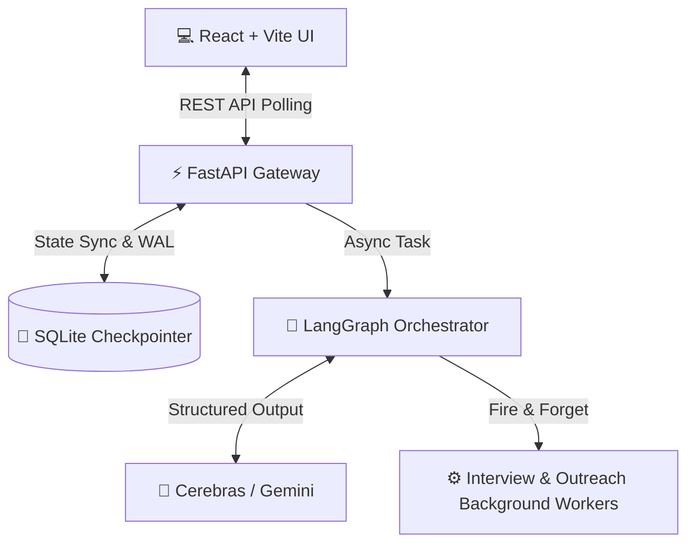
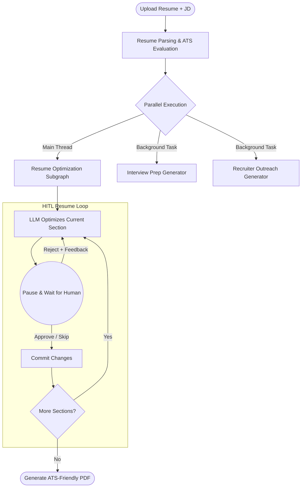

<div align="center">

# 🤖 AI Resume Tailoring & Interview Copilot

### An Agentic AI Career Assistant built with **LangGraph**, **FastAPI**, and **React**

Optimize resumes with Human-in-the-Loop approval, generate personalized interview preparation, and create recruiter outreach messages — all through a modular, stateful LangGraph workflow.

---


</div>

---

# 📌 Overview

Recruiters receive thousands of generic resumes, resulting in low ATS scores and missed opportunities. This project automates the resume tailoring process using an **Agentic AI workflow** powered by **LangGraph**.

Instead of blindly rewriting an entire resume and risking AI hallucination, this system:

1. Analyzes the existing resume against a specific Job Description.
2. Evaluates ATS compatibility and missing skills.
3. Optimizes the resume **one section at a time**.
4. **Pauses for human approval** (Human-in-the-Loop) after every section.
5. Concurrently generates interview preparation and recruiter outreach templates in the background.

The result is a perfectly tailored, ATS-friendly PDF resume while the user maintains **100% creative control**.

---

# ✨ Key Features

- **🧠 Smart Resume Analysis**  
  PDF parsing, structured data extraction, and hybrid ATS evaluation.

- **⏸️ Human-in-the-Loop (HITL)**  
  The LLM optimizes one section (for example, **Projects**), pauses execution, and waits for human approval, rejection, or feedback before proceeding.

- **⚡ Concurrent AI Workers**  
  While you review your resume, detached background workers generate behavioral interview questions and recruiter outreach templates.

- **💾 Stateful Memory**  
  Powered by SQLite with Write-Ahead Logging (WAL) to support concurrent API polling and LangGraph checkpointing without database locking.

- **📄 ATS-Friendly Export**  
  Compiles approved resume sections into a clean, parser-friendly PDF.

---

# 🏗️ System Architecture

The application follows **Domain-Driven Design (DDD)**, completely decoupling the React frontend from the LangGraph AI engine through a FastAPI gateway.



---

# 🔄 Agentic Execution Flow

Instead of relying on linear prompting, the backend executes a **Directed Acyclic Graph (DAG)** with conditional routing, dynamic section skipping, and parallel branch execution.



---

# 📂 Project Structure

```text
AI-Resume-Copilot/
│
├── app/                        # 🧠 Core Backend (FastAPI + LangGraph)
│   │
│   ├── api/                    # The Gateway: Handles HTTP requests & DTO validation. Zero AI logic here.
│   │   ├── dtos/               # JSON contracts (Ensures structured communication with the UI)
│   │   └── routes.py           # Traffic controller, background task spawner, and thread-locker
│   │
│   ├── graph/                  # The Orchestrator: LangGraph state machine
│   │   ├── builders/           # The blueprints: Wires nodes and edges into a DAG
│   │   ├── nodes/              # Execution units: Does the actual work (e.g., optimize_section, parse_resume)
│   │   ├── routers/            # Decision makers: Centralized conditional logic (e.g., Retry vs. Move Next)
│   │   └── state/              # The Memory: Global state definitions and dictionary reducers
│   │
│   ├── models/                 # Pydantic schemas: Forces the LLMs to return strict, parseable JSON
│   │
│   ├── workers/                # Fire-and-forget background jobs (Interview & Outreach generation)
│   │
│   ├── utils/                  # Infrastructure: LLM routing (Cerebras/Gemini) & SQLite WAL Checkpointer
│   │
│   └── main.py                 # FastAPI application entry point
│
├── data/                       # Local File System
│   ├── uploads/                # Temporarily stores uploaded PDF resumes
│   └── checkpoints.sqlite      # Persistent LangGraph state memory
│
├── frontend-react/             # 💻 Client UI (React + Vite)
│   ├── src/
│   │   ├── components/         # Modular UI (Workspace, Resume Panels, Timeline)
│   │   ├── hooks/              # State sync and API polling logic (e.g., useWorkflowStatus)
│   │   └── services/           # Axios/Fetch clients communicating with FastAPI
│   └── package.json
│
├── requirements.txt            # Python dependencies
└── README.md
```

---

# ⚙️ Technology Stack

| Category | Technologies |
|-----------|--------------|
| **Frontend** | React, Vite, Tailwind CSS |
| **Backend Gateway** | FastAPI, Uvicorn |
| **AI Orchestration** | LangGraph, LangChain |
| **LLM Providers** | Cerebras (Primary), Gemini (Fallback) |
| **State Validation** | Pydantic Structured Outputs |
| **Persistence** | SQLite (WAL Checkpointing) |
| **Document Processing** | PyMuPDF, ReportLab |

---

# 🚀 Getting Started

## Prerequisites

- Python **3.11+**
- Node.js **18+**
- Cerebras API Key and/or Gemini API Key

---

## 1️⃣ Clone the Repository

```bash
git clone https://github.com/your-username/AI-Resume-Copilot.git

cd AI-Resume-Copilot
```

---

## 2️⃣ Backend Setup

```bash
# Create virtual environment
python -m venv .venv

# Activate virtual environment

# Linux / macOS
source .venv/bin/activate

# Windows
.venv\Scripts\activate

# Install dependencies
pip install -r requirements.txt

# Create .env
CEREBRAS_API_KEY=your_api_key
GEMINI_API_KEY=your_api_key

# Start backend
python app/main.py
```

Backend runs at:

```
http://localhost:8000
```

---

## 3️⃣ Frontend Setup

```bash
cd frontend-react

npm install

npm run dev
```

Frontend runs at:

```
http://localhost:5173
```

---

# 🌐 API Overview

The React frontend communicates exclusively with FastAPI endpoints, remaining completely decoupled from the LangGraph workflow.

| Method | Endpoint | Purpose |
|---------|----------|----------|
| **POST** | `/api/v1/workflow/start` | Upload Resume & Job Description |
| **GET** | `/api/v1/workflow/{id}` | Poll workflow status |
| **GET** | `/api/v1/resume/task/current/{id}` | Retrieve current HITL task |
| **POST** | `/api/v1/resume/task/approve/{id}` | Resume graph execution after approval |
| **GET** | `/api/v1/exports/{id}/resume` | Download finalized ATS-friendly PDF |

---

<div align="center">

## ⭐ If you found this project useful, consider giving it a Star!


</div>